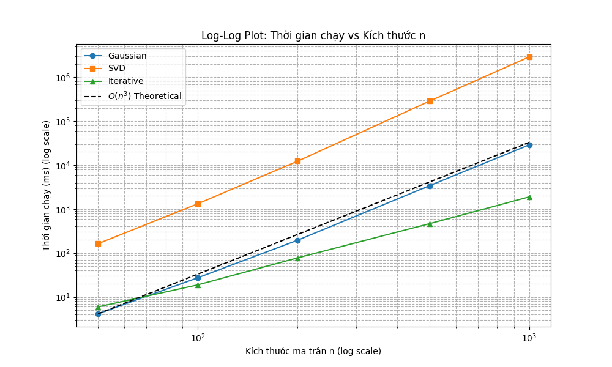

# Applied Mathematics And Statistics


****
<p align="center">
  
  
  
  
</p>

**GROUP 01 - 24CTT3** 
| Họ tên             | MSSV     |
|--------------------|----------|
| Ngô Hoàng Minh     | 24120381 |
| Đỗ Ngọc Hải        | 24120300 |
| Nguyễn Thành Dự    | 24120288 |
| Mai Thúc Hải Đăng  | 24120276 |
| Nguyễn Xuân Lộc    | 24120369 |

## 📂 Cấu trúc thư mục
```
AppliedMathematics/
│
├── Part1/
│ ├── back_substitution.py
│ ├── determinant.py
│ ├── helper_function.py
│ ├── inverse.py
│ ├── part1_demo.ipynb
│ ├── rank_basis.py
│ ├── gaussian.py
│
├── Part2/
│ ├── Jacobi.py
│ ├── decomposition.py
│ ├── diagonalization.py
│ ├── logo-hcmus-new.png
│ ├── manim_scene.py
│ ├── part2_demo.ipynb
│
├── Part3/
│ ├── solvers.py
│ ├── benchmark.py 
│ ├── analysis.py
├── main.py
└── README.md
```

## 🚀 Cách chạy chương trình
### 1. Clone repository
```bash
git clone https://github.com/nhminh107/AppliedMathematics.git
cd AppliedMathematics
```

### 2. Runfile
Dùng lệnh như sau: 
```bash
python -m Part<i>.<file_name>
```
Trong đó i là 1/2/3; file_name là tên file muốn chạy

## 🧪 Các file Test
Các đoạn test nhóm em để vào trong các file **Notebook**. Riêng với Diagonalization, vì nó gọi tới nhiều hàm ở Part1 và các file khác nên nhóm em bỏ bộ test vào trong file

Đối với Part3, vì file code chạy rất lâu ở n = 1000 nên em để ảnh Plot LOG - LOG cũng như link chạy test dưới đây : 
https://www.kaggle.com/code/nhminh107/run-benchmark


